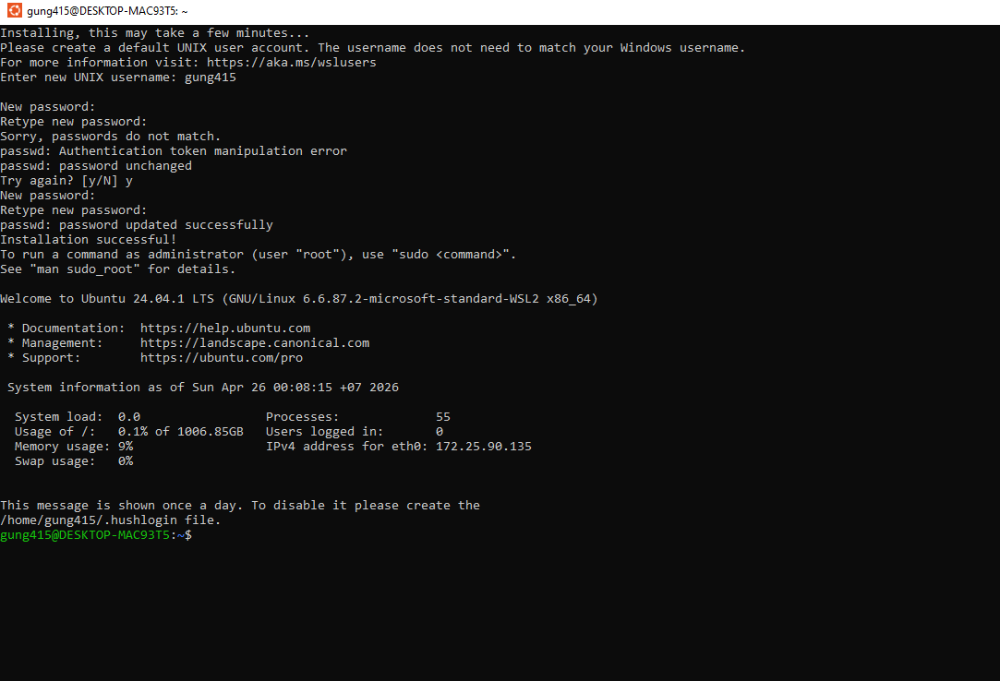
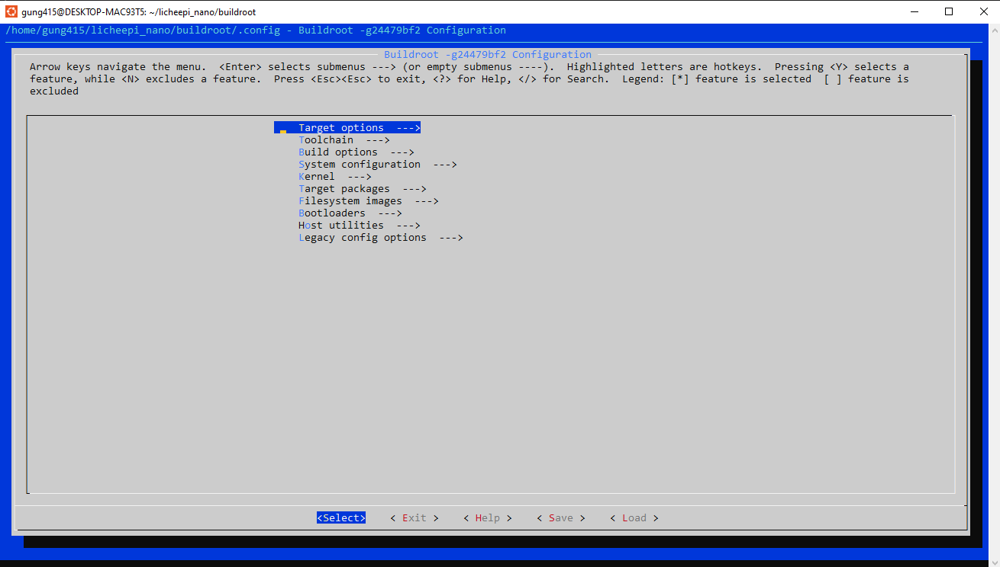
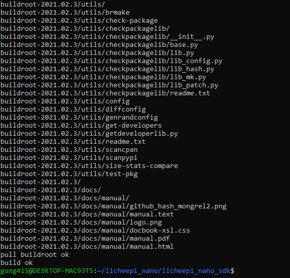
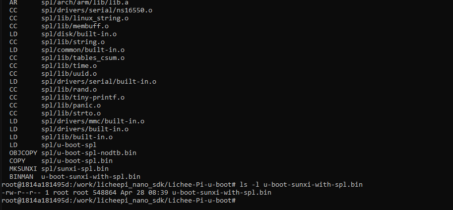

EMBEDDED LINUX - LICHEEPI NANO

Bước 1: Kích hoạt nền tảng ảo hóa trên Windows
 Trước khi cài được Linux, bạn phải cho phép Windows chạy chế độ máy ảo.

 Thực hiện: Mở Command Prompt (Admin), chạy lệnh wsl --install.
 Kết quả: Hệ thống đã bật Virtual Machine Platform và Windows Subsystem for Linux.
 Lưu ý: Bạn đã hoàn thành bước này và cần khởi động lại máy (Restart) để có hiệu lực.

Bước 2: Cài đặt hệ điều hành Ubuntu (WSL2)
 Thay vì dùng máy ảo VMware nặng nề, bạn chọn dùng WSL2 để nhẹ máy và build code nhanh hơn.

 Thực hiện: Vào Microsoft Store, tìm bản Ubuntu (bản chính chủ logo cam) và nhấn Get/Install.
 Khởi tạo: Mở Ubuntu lên, đặt Username (ví dụ: manhhung) và Password.
 Lưu ý: Khi gõ mật khẩu trong Linux, màn hình sẽ không hiện ký tự, cứ gõ xong rồi Enter.

_ Cập nhật hệ thống để giúp Ubuntu luôn ở trạng thái mới nhât : sudo apt update && sudo apt upgrade -y
_ Cài đặt Dependencies cho hệ thống : sudo apt install -y build-essential libncurses5-dev libssl-dev bison flex \ git bc u-boot-tools device-tree-compiler gcc-arm-linux-gnueabi \ python3 python3-dev python3-setuptools swig libelf-dev wget

Bước 3 : tải mã nguồn buildroot và tạo thư mục 
 _ tạo thư mục : mkdir ~/licheepi_nano
 _ Tải build root : git clone https://github.com/buildroot/buildroot.git --depth=1
cd buildroot
 _ chạy thử : make menuconfig
 
 _ Buildroot thành công 
 
 _ Build U-Boot Lichee Pi Nano thành công
  

 