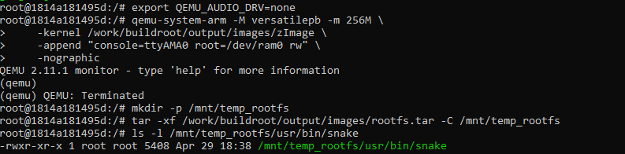

EMBEDDED LINUX - LICHEEPI NANO

Sản phẩm cuối cùng (Deliverables): Download u-boot-sunxi-with-spl.bin  https://drive.google.com/drive/u/1/folders/1Q5pth0KcZJTVVK6plZnPpDrBxEI-p6PS

Mô tả: File đã được build thành công cho kiến trúc ARM (Lichee Pi Nano), bao gồm cả SPL và U-Boot.

Bộ mã nguồn đầy đủ (SDK): Download licheepi_nano_sdk.tar.gz https://drive.google.com/drive/u/1/folders/1Q5pth0KcZJTVVK6plZnPpDrBxEI-p6PS
## 1. 🔍 Phân tích Boot Flow (Giải thích cấu trúc hệ thống)
Để hệ điều hành khởi động thành công trên chip Allwinner F1C100s, quy trình diễn ra như sau:
_ BROM: Chip tìm nạp SPL từ thẻ nhớ tại vị trí 8KB (Offset).

_ SPL (Secondary Program Loader): Khởi tạo xung nhịp và quan trọng nhất là đánh thức RAM (DRAM).

_ U-Boot: Trình nạp chính, tìm và tải nhân Linux (zImage) cùng file cấu hình phần cứng (DTB) vào RAM.

_ Kernel & RootFS: Nhân Linux chạy và gắn kết phân vùng chứa hệ điều hành để bắt đầu phiên làm việc.

## 2. ⚙️ Quy trình thực hiện (Pipeline Build)

### Bước 1: Kích hoạt nền tảng ảo hóa trên Windows
 Trước khi cài được Linux, phải cho phép Windows chạy chế độ máy ảo.

 Thực hiện: Mở Command Prompt , chạy lệnh wsl --install.
 Kết quả: Hệ thống đã bật Virtual Machine Platform và Windows Subsystem for Linux.
 

Bước 2: Cài đặt hệ điều hành Ubuntu (WSL2)
 Sử dụng Docker để thiết lập môi trường Build

 *Tại sao dùng Docker? Thay vì cài đặt trực tiếp các công cụ build lên Ubuntu có thể gây lỗi xung đột thư viện, em sử dụng Docker để đảm bảo môi trường build  ổn định, sạch sẽ 
 
 Lưu ý: Khi gõ mật khẩu trong Linux, màn hình sẽ không hiện ký tự, cứ gõ xong rồi Enter.

_ Cập nhật hệ thống để giúp Ubuntu luôn ở trạng thái mới nhât : 
  sudo apt update && sudo apt upgrade -y
_ Cài đặt Dependencies cho hệ thống : sudo apt install -y build-essential libncurses5-dev libssl-dev bison flex git bc u-boot-tools device-tree-compiler gcc-arm-linux-gnueabi python3 python3-dev swig libpython2.7-dev python-dev libelf-dev wget

### Bước 3 : tải mã nguồn buildroot và tạo thư mục 
 _ tạo thư mục : mkdir ~/licheepi_nano
 _ Tải build root : git clone https://github.com/buildroot/buildroot.git --depth=1
cd buildroot
 _ chạy thử : make menuconfig
 
 _ Buildroot thành công 
 
 _ Build U-Boot Lichee Pi Nano thành công
  Lệnh cấu hình: make ARCH=arm licheepi_nano_defconfig
  Lệnh build: make ARCH=arm CROSS_COMPILE=arm-linux-gnueabi- -j$(nproc)
  
_ Hoàn thành RootFS
  

## 3. 🛠️ Nhật ký Debug 
Lỗi gặp phải: Build ra file "Sandbox" : Quên chỉ định kiến trúc ARCH=arm, dẫn đến build cho máy tính x86.
Cách khắc phục : Thêm tham số ARCH=arm vào tất cả các lệnh make.

Lỗi gặp phải: Thiếu thư viện liên kết giữa Python và Device Tree Compiler (SWIG).
Cách khắc phục :Cài đặt bổ sung swig và python-dev vào Docker.

Lỗi gặp phải: Script đóng gói tự động lỗi trong môi trường ảo hóa.
Cách khắc phục : Sử dụng lệnh cat spl/sunxi-spl.bin u-boot.img > u-boot-sunxi-with-spl.bin để đóng gói thủ công.

## 4. 🗂️Cấu trúc thẻ nhớ (Flash Image)
Để board boot được, thẻ nhớ cần được chia như sau:

Offset 8KB: Nạp file u-boot-sunxi-with-spl.bin (Dùng lệnh dd).
Partition 1 (FAT32): Chứa zImage và suniv-f1c100s-licheepi-nano.dtb.
Partition 2 (EXT4): Chứa toàn bộ RootFS (giải nén từ file .tar).

## 5. Kết quả thử nghiệm
Kiểm tra file nhị phân: Lệnh file spl/sunxi-spl.bin trả về kết quả là data (chuẩn Binary cho ARM).
Mô phỏng QEMU: Đã nạp thành công RootFS vào QEMU, xác nhận hệ thống có đầy đủ các ứng dụng như snake trong /usr/bin/.

 